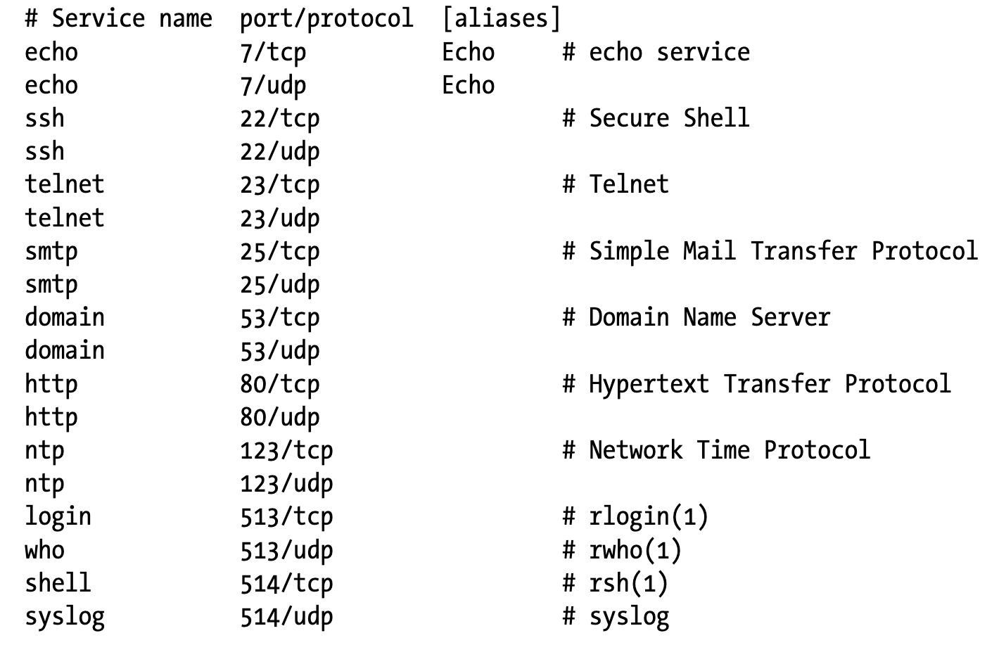

# Definition
A port number is a 16-bit identifier used by a single server to handle various services on the same machine. Instead of having separate servers for each service, like one for HTTP and another for FTP, which wastes resources and incurs additional costs, a single server can manage multiple services efficiently. Each server is identified by an IP address, and the 16-bit port number allows different services to run on it. For instance, SSH might use port 22, while HTTP uses port 80. Each of these ports has a corresponding service name.

# How it works
to understand how the Port numbers work, we first need to understand the `/etc/services` file.
`/etc/services`file contains a list of network services and ports mapped to them.

it consist of three columns service name, port/protocol and aliases. it explains it self.
so in order for `getaddrinfo()` to find the corresponding service in that port it will look inside this file and find the corresponding service name in each port and protocol that we gave it in the `struct addrinfo hints` param.
